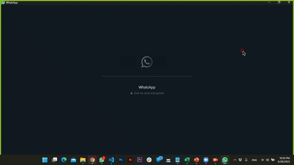

# Spam Filter Integration with WhatsApp (A Comparative Analysis)

> Classifying spam messages and highlight the chat heads which contain such messages.


## ✨Update 6th August, 2022
We are providing a solution for those people who are facing the issue of spam in WhatsApp. Our solution filters out the spam messages and highlight the chat heads which contain such messages. 

## Why?

SMS spamming is a major annoyance for customers and can result in the loss of important communications. It is also used to deceive people into purchasing services. Instant messaging is becoming increasingly vulnerable to security concerns, including spam messages. Unlike email spam, SMS spam puts personal information at risk, making users susceptible to cyber attacks. This can lead to financial and functional losses, as well as data breaches. SMS spam is also linked to the spread of malware and keyloggers.

## Goals
This project aims to address security challenges in privacy protection, solidarity, and accessibility by researching data science and machine learning techniques such as sentiment analysis and natural language processing. Specifically, the focus is on detecting and categorizing SMS spam using various datasets, preprocessing methods, and feature extraction techniques. The system utilizes multiple machine learning filters and classifiers, including Naïve Bayes, Support Vector Machine, and Artificial Intelligence algorithms like InceptionV3 and Resnet. The goal is to create a desktop application capable of identifying and filtering spam in incoming SMS messages.

## 🔍 Preview 

## ⚡ Features 

* 🎨 Highly customizable json
* 💯 Totally Free for personal use
* 🔒 Complete Privacy. Your data stays with you always
* 💻 Download media files automatically
* 👥 Multiple instances 


### Quick preview



## Supported Platforms
Following platforms are supported:

**macOS:**
The minimum version supported is macOS 10.9.

**Windows:**
Windows 7 and later are supported.

**Linux:**
- Ubuntu 12.04 and later
- Fedora 21
- Debian 8

## How to start the BOT?

### STEPS

After downloading, extract the zip file and navigate to that location in your terminal. There will be a file named ```wbot-*``` . Run it and you should be good to go.

For Linux you need to provide executable permission before you execute the binary. 
Run the command - 
```
chmod +x wbot-linux && wbot-linux
```

Note: On Linux you need a running display server (X11 or Wayland).
If you run Linux on a headless server or want to run chmomium without visible display try ```xvfb-run wbot-linux```.

## 💻 Technologies
* [Node](https://nodejs.org/en/)
* [puppeteer](https://github.com/GoogleChrome/puppeteer)
* [Python](https://www.python.org/)
* [Jupyter Notbook](https://jupyter.org/)
* [Flask](https://flask.palletsprojects.com/en/2.3.x/)


