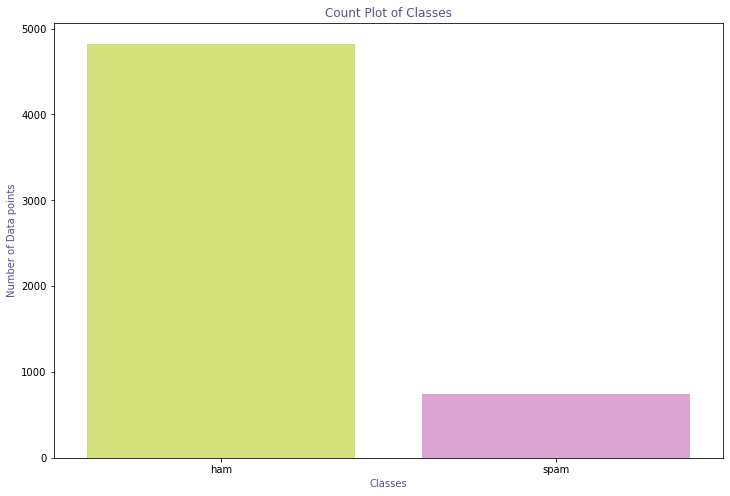
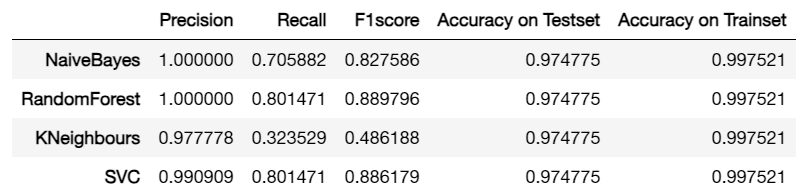
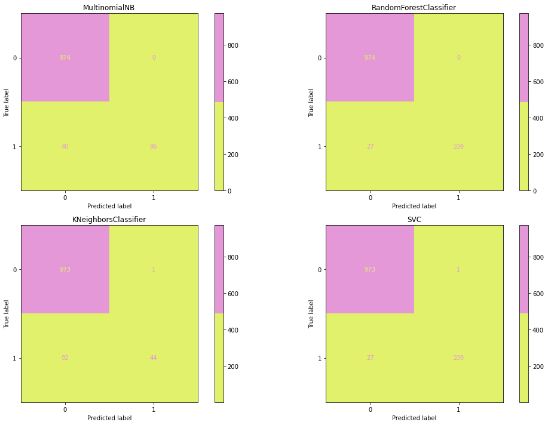

# Jupyter Notebook

## ✨Update 6th August, 2022
Here we train different machine learning models for analysing the best classifier. In result, you can see Multinomial Naive Bayes is the best one.

### Quick Analysis
* Dataset CSV

* Analysis Table

* Analysis Chart
